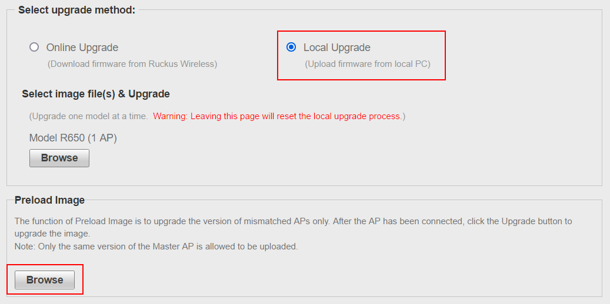

# Bypassing the Country Lock for a US model Ruckus AP

Ruckus access points may be cheaper to buy from the USA.

But Ruckus locks the country code on `US` model access points (unlike `WW` models), so you can't use the correct WiFi bands for other countries.
And `US` model access points will refuse to join any existing Unleashed or ZoneDirector network which doesn't have its country code set to US.
The country cannot be changed from the Web interface, and if you try to SSH in and `set countrycode XX` from the CLI then you receive an error: `illegal to change country code`.

Fortunately, it's possible to bypass the country lock, or even turn a locked `US` AP into an unlocked `WW` AP...

## Option 1: Permanently removing the country lock from an Unleashed AP

[This patch](../images/unleashed.unlock.dbg) should be uploaded as a `Preload Image` (`Admin & Services` > `Administration` > `Upgrade` > `Local Upgrade` > `Preload Image`).  
> The upload process completes the unlock; no upgrade will be offered. Simply wait a few seconds after the upload, then force-refresh your browser.  
>   
> The option to change your country code will now be available at `Admin & Services` > `System` > `Country Code`

You can, if you wish, [create the patch yourself](../Scripts/create_unleashed_unlock.sh).
Alternatively, you can [decrypt the patch](DecryptRuckusBackups.md)  to verify it's only doing what it should.

## Option 2: Changing the locked Country Code

SSH into the AP (using the same credentials you use to log into the web dashboard).

If your AP is running Unleashed firmware, then you'll need to get it into AP mode:
```console
enable
ap-mode
```

Manually update the country code (my example changes it to New Zealand):
```console
set rpmkey wlan-country-code NZ
```

The real `set countrycode NZ` would have set this rpmkey, but also fixed up the wifi channels. We're not running the fixup code, so it's safest to do a factory reset now:
```console
set factory
reboot
```

Job done.

## Option 3: Manually removing the country lock (for pre-2020 AP models, including non-Unleashed APs)

### 1) Obtain a root shell

The unlocking procedure requires you to *temporarily* install an older software version.  
Ensure the installed access point software was released in November 2019 or earlier. Otherwise, download an older version from [https://support.ruckuswireless.com/software](https://support.ruckuswireless.com/software) and do an 'upgrade'.  

SSH into the AP *using the same credentials you use to log into the web dashboard*, then break out to a root shell. There is a different procedure depending on whether or not your AP is running Unleashed software:

* [Unleashed Access Points](https://alephsecurity.com/vulns/aleph-2019004#proof-of-concept)

```console
ruckus> enable 
ruckus# debug 
You have all rights in this mode.
ruckus(debug)# script 
ruckus(script)# exec ../../../bin/sh


Ruckus Wireless ZoneDirector -- Command Line Interface
Enter 'help' for a list of built-in commands.

ruckus$ stty echo
ruckus$
```

> You won't be able to see yourself typing `stty echo`. Calling `stty echo` restores local echo so you can see what you're typing.

* [Other Access Points](https://alephsecurity.com/vulns/aleph-2019014#proof-of-concept)

```console
rkscli: Ruckus
```

Now type `";/bin/sh;"` and hit enter *(you won't be able to see what you're typing)*

```console
grrrr
```

> Instead of `grrrr`, any other random dog noise could  be printed to the screen. 

```console
rkscli: !v54!
What's your chow: 
```

Now hit enter twice

```console
BusyBox v1.15.2 (2015-07-21 22:07:19 PDT) built-in shell (ash)
Enter 'help' for a list of built-in commands.

#
```

### 2) Remove the Country Lock

```console
# rbd country 0
```
Should see something like this:
```console
bdSave: sizeof(bd)=0x7c, sizeof(rbd)=0xd0
  caching flash data from /dev/mtd8 [ 0x00000000 - 0x00010000 ]
  updating flash data [0x00000000 - 0x0000007c] from [0x7f8cdc88 - 0x7f8cdd04]
  updating flash data [0x00008000 - 0x000080d0] from [0x7f8cdd04 - 0x7f8cddd4]
_erase_flash: offset=0x0 count=1
Erase Total 1 Units
Performing Flash Erase of length 262144 at offset 0x0 done
  caching flash data from /dev/mtd8 [ 0x00000000 - 0x00010000 ]
  verifying flash data [0x00000000 - 0x0000007c] from [0x7f8cdc88 - 0x7f8cdd04]
  verifying flash data [0x00008000 - 0x000080d0] from [0x7f8cdd04 - 0x7f8cddd4]
```

Your Access Point is now permanently unlocked. You can safely upgrade to any newer/older version of the software.
