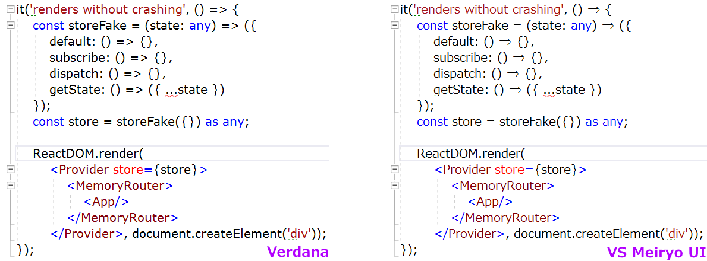

# HiDPI Verdana for Visual Studio 2019

Verdana is the perfect programming font... but it looks kinda chunky at 150% magnification (which is the default for a 27" 4K screen).

Meiryo's latin characters are pretty much identical to Verdana, but with updated hinting which is much improved on HiDPI screens. Unfortunately (for programmers) Meiryo's `\` is replaced with `¥`, and Visual Studio ignores the substitution table entry which would fix this.

So I've created a tweaked font (in FontForge) which puts the correct backslash glyph back. I also added a => ligature, widened the hyphen, lowered the asterisk, and tweaked the kerning on angle brackets.



You probably don't have Meiryo, so from the Optional features Settings (try typing "Manage Optional Features" in the Start menu), add the Japanese Supplemental Fonts.

FontForge needs to run the script which generates the new font:
```Batchfile
"C:\Program Files (x86)\FontForgeBuilds\bin\fontforge.exe" -script vsMeiryo.py
```

Where `vsMeiryo.py` is:
```python
import fontforge

def unmapGlyph(font, glyphname):
    glyph = font[glyphname]
    glyph.unicode = -1
    glyph.glyphname = ".unmapped" + glyph.glyphname

def modifyFont(font):
    # bigger, lowered asterisk
    plus = font["plus"]
    unmapGlyph(font, "asterisk")
    asterisk = font.createChar(0x2A, "asterisk")
    asterisk.width = 1446
    asterisk.vwidth = plus.vwidth
    asterisk.addReference("uniFF0A", psMat.translate(-300, -50))

    # remap hyphen-minus from figuredash (which is short and fat) to minus (which is long and skinny)
    font["figuredash"].altuni = tuple(
        [a[0] for a in font["figuredash"].altuni if a[0] != 0x2D])
    minus = font["minus"]
    minus.altuni = tuple([a[0] for a in minus.altuni]) + (0x2D,)

    # make minus a little shorter
    minus.width = 1410
    minusContour = fontforge.contour()
    minusContour.is_quadratic = True
    minusContour.moveTo(1205, 585)
    minusContour.lineTo(205, 585)
    minusContour.lineTo(205, 733)
    minusContour.lineTo(1205, 733)
    minusContour.closed = True
    minusLayer = fontforge.layer()
    minusLayer.is_quadratic = True
    minusLayer += minusContour
    minus.foreground = minusLayer

    # this is a japanese font: use the proper backslash instead of the yen sign
    # (there's a substitution table entry to do this, but VS doesn't use it)
    unmapGlyph(font, "backslash")
    backslash = font["glyph99"]
    backslash.unicode = 0x5C
    backslash.glyphname = fontforge.nameFromUnicode(backslash.unicode)

    # nice looking => glyph
    goesTo = font.createChar(-1, ".unmappedgoesto")
    goesTo.width = 2412
    goesToContour = fontforge.contour()
    goesToContour.is_quadratic = True
    goesToContour.moveTo(2182, 674)
    goesToContour.lineTo(1660, 21)
    goesToContour.lineTo(1578, 86)
    goesToContour.lineTo(1826, 375)
    goesToContour.lineTo(230, 375)
    goesToContour.lineTo(230, 523)
    goesToContour.lineTo(1938, 523)
    goesToContour.lineTo(2056, 672)
    goesToContour.lineTo(1959, 795)
    goesToContour.lineTo(230, 795)
    goesToContour.lineTo(230, 943)
    goesToContour.lineTo(1825, 943)
    goesToContour.lineTo(1586, 1195)
    goesToContour.lineTo(1664, 1265)
    goesToContour.closed = True
    goesToLayer = fontforge.layer()
    goesToLayer.is_quadratic = True
    goesToLayer += goesToContour
    goesTo.foreground = goesToLayer
    goesTo.autoHint()
    goesTo.autoInstr()

    # ligature so our nice looking => glyph gets used
    font.addLookup("ligavs", "gsub_ligature", (),
                   (("liga", (("latn", ("dflt")),)),))
    font.addLookupSubtable("ligavs", "ligavs")
    goesTo.addPosSub("ligavs", ("equal", "greater"))

    # kern pairs for << >> ||
    font.addLookup("kernvs", "gpos_pair", (),
                   (("kern", (("latn", ("dflt")),)),))
    font.addLookupSubtable("kernvs", "kernvs")
    font["less"].addPosSub("kernvs", "less", -250)
    font["greater"].addPosSub("kernvs", "greater", -250)
    font["bar"].addPosSub("kernvs", "bar", -294)

    # reencode so our new chars get used
    font.reencode("unicode")

def nameFont(font, fontFamily, fontWeight):
    font.familyname = fontFamily
    fontIsBold = "Bold" in fontWeight
    fontIsItalic = "Ital" in fontWeight
    font.weight = "Bold" if fontIsBold else "Book"
    fontNeedsSuffix = (fontIsBold or fontIsItalic)
    font.fontname = font.familyname.replace(
        " ", "") + (("-" + fontWeight.replace(" ", "")) if fontNeedsSuffix else "")
    font.fullname = font.familyname + \
        ((" " + fontWeight) if fontNeedsSuffix else "")
    font.uniqueid = 0
    font.sfnt_names = ((0x409, 1, font.familyname),
                       (0x409, 2, fontWeight), (0x409, 4, font.fullname))
    font.os2_weight = 700 if fontIsBold else 400
    font.macstyle = (0x01 if fontIsBold else 0x00) | (
        0x02 if fontIsItalic else 0x00)
    panose = list(font.os2_panose)
    if (panose[2] <= 0x06 and fontIsBold):
        panose[2] = 0x08
    if (panose[2] > 0x06 and not fontIsBold):
        panose[2] = 0x06
    if (panose[7] >= 0x02 and panose[7] <= 0x08 and fontIsItalic):
        panose[7] += 0x07
    if (panose[7] >= 0x09 and panose[7] <= 0x0F and not fontIsItalic):
        panose[7] -= 0x07
    font.os2_panose = tuple(panose)

def main(argv):
    font = fontforge.open("C:\\Windows\\Fonts\\meiryo.ttc(Meiryo UI)")
    modifyFont(font)
    nameFont(font, "Vs Meiryo UI", "Regular")
    font.generate(font.fontname + ".ttf")
    font.close()

if __name__ == '__main__':
    main(sys.argv[1:])
```
