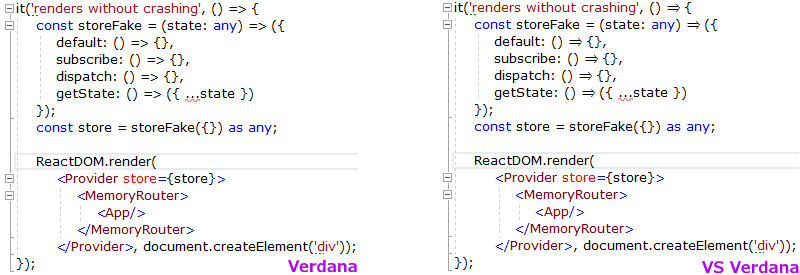

# Verdana tweaked for Visual Studio 2019

Verdana is the perfect programming font... but the latest Visual Studio releases do some per-symbol layout malarkey which ruins the angle bracket kerning. I guess nobody at Microsoft uses proportional fonts anymore.

So I've created a tweaked font (in FontForge) which abuses the glyph hinting so that everything looks nice again in Visual Studio. I also added a => ligature, and widened the hyphen.



FontForge needs to run the script which generates the new font:
```Batchfile
"C:\Program Files (x86)\FontForgeBuilds\bin\fontforge.exe" -script vsVerdana.py
```

Where `vsVerdana.py` is:
```python
import fontforge
import sys

def unmapGlyph(font, glyphname):
    glyph = font[glyphname]
    glyph.unicode = -1
    glyph.glyphname = ".unmapped" + glyph.glyphname

def modifyFont(font):
    # remap hyphen (short & fat) to figuredash (long and skinny)
    unmapGlyph(font, "hyphen")
    figuredash = font["figuredash"]
    figuredash.altuni = (0x2D,)

    # nice looking => glyph
    goesTo = font.createChar(-1, ".unmappedgoesto")
    goesTo.width = 2412
    goesToContour = fontforge.contour()
    goesToContour.is_quadratic = True
    goesToContour.moveTo(2182, 672)
    goesToContour.lineTo(1660, 21)
    goesToContour.lineTo(1578, 86)
    goesToContour.lineTo(1826, 362)
    goesToContour.lineTo(230, 362)
    goesToContour.lineTo(230, 522)
    goesToContour.lineTo(1938, 522)
    goesToContour.lineTo(2056, 672)
    goesToContour.lineTo(1959, 782)
    goesToContour.lineTo(230, 782)
    goesToContour.lineTo(230, 942)
    goesToContour.lineTo(1825, 942)
    goesToContour.lineTo(1586, 1195)
    goesToContour.lineTo(1664, 1265)
    goesToContour.closed = True
    goesToLayer = fontforge.layer()
    goesToLayer.is_quadratic = True
    goesToLayer += goesToContour
    goesTo.foreground = goesToLayer
    goesTo.ttinstrs = fontforge.parseTTInstrs("""NPUSHB\n32\n4\n84\n5\n9\n84\n5\n15\n10\n1\n10\n64\n15\n1\n48\n15\n64\n15\n2\n3\n4\n9\n47\n8\n64\n8\n2\n8\n8\n64\n9\n1\n9\nMDAP[rnd]\nDELTAP1\nSHP[rp1]\nMDAP[rnd]\nDELTAP1\nSRP2\nIP\nIP\nDELTAP1\nDELTAP1\nSVTCA[y-axis]\nMDAP[rnd]\nDELTAP1\nSHP[rp1]\nMIRP[min,rnd,black]\nMDAP[rnd]\nMIRP[min,rnd,black]\nIUP[x]\nIUP[y]""")

    font["less"].ttinstrs = fontforge.parseTTInstrs("""PUSHB_5\n 115\n 5\n 1\n 44\n 0\nPUSHW_1\n -30\nNPUSHB\n 31\n 10\n 24\n 55\n 3\n 30\n 10\n 24\n 55\n 3\n 31\n 0\n 47\n 0\n 2\n 3\n 15\n 0\n 1\n 0\n 8\n 4\n 5\n 1\n 0\n 0\n 64\n 1\n 80\n 1\n 2\n 1\nMDAP[rnd]\nDELTAP1\nSHP[rp1]\nMDAP[rnd]\nSRP2\nIP\nIP\nSHP[rp1]\nSVTCA[y-axis]\nMDAP[rnd]\nDELTAP1\nSHP[rp1]\nDELTAP1\nMDAP[rnd]\nCALL\nCALL\nIUP[x]\nIUP[y]\nMPPEM\nGTEQ\nIF\nNPUSHB\n 11\n 5\n 4\n 84\n 3\n 2\n 3\n 6\n 84\n 0\n 1\n 0\nSDPVTL[orthog]\nSRP0\nMIRP[rp0,min,rnd,black]\nSDPVTL[orthog]\nSRP0\nMIRP[rp0,min,rnd,black]\nSFVTCA[x-axis]\nMDRP[grey]\nEIF\nSVTCA[x-axis]\nDELTAP1""")

    font["greater"].ttinstrs = fontforge.parseTTInstrs("""PUSHB_5\n 124\n 3\n 1\n 44\n 1\nPUSHW_1\n -30\nNPUSHB\n 33\n 10\n 24\n 55\n 5\n 30\n 10\n 24\n 55\n 5\n 31\n 1\n 47\n 1\n 2\n 5\n 15\n 1\n 1\n 1\n 8\n 3\n 5\n 1\n 0\n 0\n 47\n 1\n 48\n 1\n 64\n 1\n 3\n 1\nMDAP[rnd]\nDELTAP1\nSHP[rp1]\nMDAP[rnd]\nSRP2\nIP\nIP\nSHP[rp1]\nSVTCA[y-axis]\nMDAP[rnd]\nDELTAP1\nSHP[rp1]\nDELTAP1\nMDAP[rnd]\nCALL\nCALL\nIUP[x]\nIUP[y]\nMPPEM\nGTEQ\nIF\nNPUSHB\n 11\n 3\n 4\n 84\n 5\n 5\n 6\n 2\n 84\n 1\n 1\n 0\nSDPVTL[orthog]\nSRP0\nMIRP[rp0,min,rnd,black]\nSDPVTL[orthog]\nSRP0\nMIRP[rp0,min,rnd,black]\nSFVTCA[x-axis]\nMDRP[grey]\nEIF\nSVTCA[x-axis]\nDELTAP1""")

    # ligature so our nice looking => glyph gets used
    font.addLookup("ligavs", "gsub_ligature", (),
                   (("liga", (("latn", ("dflt")),)),))
    font.addLookupSubtable("ligavs", "ligavs")
    goesTo.addPosSub("ligavs", ("equal", "greater"))

    # kern pairs for << >> ||
    font.addLookup("kernvs", "gpos_pair", (),
                   (("kern", (("latn", ("dflt")),)),))
    font.addLookupSubtable("kernvs", "kernvs")
    font["less"].addPosSub("kernvs", "less", -268)
    font["greater"].addPosSub("kernvs", "greater", -268)
    font["bar"].addPosSub("kernvs", "bar", -302)

    # reencode so our new chars get used
    font.reencode("unicode")

def nameFont(font, fontFamily, fontWeight):
    font.familyname = fontFamily
    fontIsBold = "Bold" in fontWeight
    fontIsItalic = "Ital" in fontWeight
    font.weight = "Bold" if fontIsBold else "Book"
    fontNeedsSuffix = (fontIsBold or fontIsItalic)
    font.fontname = font.familyname.replace(
        " ", "") + (("-" + fontWeight.replace(" ", "")) if fontNeedsSuffix else "")
    font.fullname = font.familyname + \
        ((" " + fontWeight) if fontNeedsSuffix else "")
    font.uniqueid = 0
    font.sfnt_names = ((0x409, 1, font.familyname),
                       (0x409, 2, fontWeight), (0x409, 4, font.fullname))
    font.os2_weight = 700 if fontIsBold else 400
    font.macstyle = (0x01 if fontIsBold else 0x00) | (
        0x02 if fontIsItalic else 0x00)
    panose = list(font.os2_panose)
    if (panose[2] <= 0x06 and fontIsBold):
        panose[2] = 0x08
    if (panose[2] > 0x06 and not fontIsBold):
        panose[2] = 0x06
    if (panose[7] >= 0x02 and panose[7] <= 0x08 and fontIsItalic):
        panose[7] += 0x07
    if (panose[7] >= 0x09 and panose[7] <= 0x0F and not fontIsItalic):
        panose[7] -= 0x07
    font.os2_panose = tuple(panose)

def main(argv):
    font = fontforge.open("C:\\Windows\\Fonts\\verdana.ttf")
    modifyFont(font)
    nameFont(font, "Vs Verdana", "Regular")
    font.generate(font.fontname + ".ttf")
    font.close()

if __name__ == '__main__':
    main(sys.argv[1:])
```
