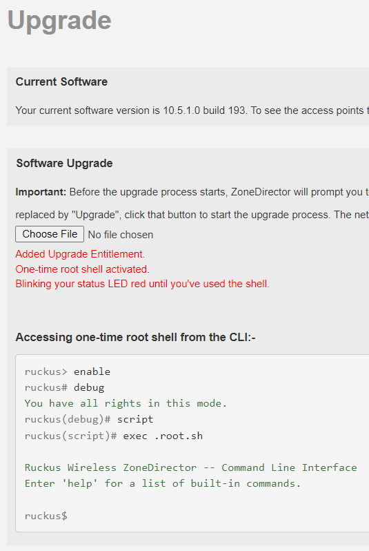

# Add a Single Use Root Shell to your ZoneDirector 1200

Until late 2019 you could escape from the Ruckus CLI to a root shell.  
You can temporarily add this functionality, without making any persistent changes to your ZD1200.  

The root shell will self-destruct the first time you use it, and the ZD1200's status LED will blink red until this happens.  

[This patch](../images/zd.temproot.img) should be uploaded as a Software Upgrade (`Administer` > `Upgrade` > `Software Upgrade`).  
> The upload process completes the patching; no upgrade will be offered. Instead you will be given instructions on using the root shell.
> 

> If you have no Upgrade Entitlement, then a temporary entitlement will also be added to your ZD1200. This will be overwritten the next time you do an online support license check.

In case you miss the instructions, to access the root shell from the CLI:-

```console
ruckus> enable 
ruckus# debug 
You have all rights in this mode.
ruckus(debug)# script 
ruckus(script)# exec .root.sh
Ruckus Wireless ZoneDirector -- Command Line Interface
ruckus$
```

## Creating the Patch Installation Image yourself (from Linux or WSL)

> Although [the patch](../images/zd.temproot.img) can be directly downloaded and used, I recommend either creating the patch yourself or [decrypting the patch](DecryptRuckusBackups.md) to verify it does only what it should.

Save the script below to e.g. `create_patched_zdimage.sh`, make it executable (e.g. `chmod +x create_patched_zdimage.sh`), then you can create an upgrade an installation image:-
```bash
./create_patched_zdimage.sh zd.temproot.img
```

```bash
#!/bin/bash

function rks_encrypt {
RUCKUS_SRC="$1" RUCKUS_DEST="$2" python3 - <<END
import os
import struct

input_path = os.environ['RUCKUS_SRC']
output_path = os.environ['RUCKUS_DEST']

(xor_int, xor_flip) = struct.unpack('QQ', b')\x1aB\x05\xbd,\xd6\xf25\xad\xb8\xe0?T\xc58')
structInt8 = struct.Struct('Q')

with open(input_path, "rb") as input_file:
    with open(output_path, "wb") as output_file:
        input_len = os.path.getsize(input_path)
        input_blocks = input_len // 8
        output_int = 0
        input_data = input_file.read(input_blocks * 8)
        for input_int in struct.unpack_from(str(input_blocks) + "Q", input_data):
            output_int ^= xor_int ^ input_int
            xor_int ^= xor_flip
            output_file.write(structInt8.pack(output_int))
        
        input_block = input_file.read()
        input_padding = 8 - len(input_block)
        input_int = structInt8.unpack(input_block.ljust(8, bytes([input_padding | input_padding << 4])))[0]
        output_int ^= xor_int ^ input_int
        output_file.write(structInt8.pack(output_int))
END
}

cat <<END >metadata
PURPOSE=upgrade
VERSION=10.99.99.99
BUILD=999
REQUIRE_SIZE=1000
REQUIRE_VERSIONS=9.9.0.0 9.10.0.0 9.10.1.0 9.10.2.0 9.12.0.0 9.12.1.0 9.12.2.0 9.12.3.0 9.13.0.0 9.13.1.0 9.13.2.0 9.13.3.0 10.0.0.0 10.1.0.0 10.1.1.0 10.1.2.0 10.2.0.0 10.2.1.0 10.3.0.0 10.3.1.0 10.4.0.0 10.4.1.0 10.5.0
REQUIRE_PLATFORM=nar5520
REQUIRE_SUBPLATFORM=cob7402
END

cat <<END >all_files
*
END

cat <<END >upgrade_check.sh
#!/bin/sh
support_status=\`cfg support-list.status | cut -d" " -f 2\`
if [ ! "\$support_status" -eq "1" ] ; then
cat <<EOF >/writable/etc/airespider/support-list.xml
<support-list status="1">
	<support zd-serial-number="\`cat /bin/SERIAL\`" service-purchased="802" date-start="`date +%s`" date-end="1819731540" ap-support-number="licensed" DELETABLE="false"></support>
</support-list>
EOF
echo "Added Upgrade Entitlement.\n<br />"
fi
rm -f /writable/etc/scripts/.root.sh
cat <<EOF >/writable/etc/scripts/.root.sh
#!/bin/sh
#RUCKUS#
rm -f /writable/etc/scripts/.root.sh
/bin/led.sh green
/bin/stty echo
/bin/sh
EOF
chmod +x /writable/etc/scripts/.root.sh
/bin/led.sh red blink
echo "One-time root shell activated.\n<br />Blinking your status LED red until you&apos;ve used the shell.<legend>Accessing the one-time root shell from the CLI:-</legend>\n<pre><code><span class=\"text-muted\">ruckus> </span>enable\n<span class=\"text-muted\">ruckus# </span>debug\n<span class=\"text-success\">You have all rights in this mode.</span>\n<span class=\"text-muted\">ruckus(debug)# </span>script\n<span class=\"text-muted\">ruckus(script)# </span>exec .root.sh\n\n<span class=\"text-success\">Ruckus Wireless ZoneDirector -- Command Line Interface</span>\n<span class=\"text-success\">Enter &apos;help&apos; for a list of built-in commands.</span>\n\n<span class=\"text-muted\">ruckus\$ </span></code></pre>"
END

chmod +x upgrade_check.sh
rm -f zd.patch.tar zd.patch.tar.gz
tar czf zd.patch.tgz metadata all_files upgrade_check.sh
rks_encrypt zd.patch.tgz "$1"
rm all_files metadata upgrade_check.sh zd.patch.tgz
```
