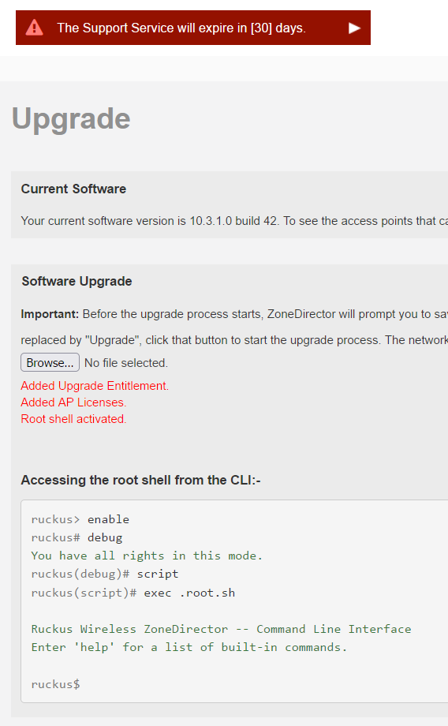

# Add a Root Shell to your ZoneDirector 1200

Until late 2019 you could escape from the Ruckus CLI to a root shell.  
You can add this functionality back to your ZoneDirector, if you'd find it useful.  

[This patch](../images/zd.root.and.licenses.patch.img) should be uploaded as a Software Upgrade (`Administer` > `Upgrade` > `Software Upgrade`).  

The upload process completes the patching; no upgrade will be offered. Instead you will be given instructions on using the root shell:-



> The upgrade will also update your AP licensing (150 APs) and Upgrade Entitlement (until August 2027).

>Subsequent software upgrades will disable the root shell and remove the patched support license: you will need to re-apply this patch each time you upgrade your ZoneDirector's software.

In case you miss the instructions, to access the root shell from the CLI:-

```console
ruckus> enable 
ruckus# debug 
You have all rights in this mode.
ruckus(debug)# script 
ruckus(script)# exec .root.sh
Ruckus Wireless ZoneDirector -- Command Line Interface
ruckus$
```

## Creating the Patch Installation Image yourself (from Linux or WSL)

> Although [the patch](../images/zd.root.and.licenses.patch.img) can be directly downloaded and used, I recommend either creating the patch yourself or [decrypting the patch](DecryptRuckusBackups.md) to verify it does only what it should.

Save the script below to e.g. `create_patched_zdimage.sh`, make it executable (e.g. `chmod +x create_patched_zdimage.sh`), then you can create an upgrade an installation image:-
```bash
./create_patched_zdimage.sh zd.root.and.licenses.patch.img
```

```bash
#!/bin/bash

function rks_encrypt {
RUCKUS_SRC="$1" RUCKUS_DEST="$2" python3 - <<END
import os
import struct

input_path = os.environ['RUCKUS_SRC']
output_path = os.environ['RUCKUS_DEST']

(xor_int, xor_flip) = struct.unpack('QQ', b')\x1aB\x05\xbd,\xd6\xf25\xad\xb8\xe0?T\xc58')
structInt8 = struct.Struct('Q')

with open(input_path, "rb") as input_file:
    with open(output_path, "wb") as output_file:
        input_len = os.path.getsize(input_path)
        input_blocks = input_len // 8
        output_int = 0
        input_data = input_file.read(input_blocks * 8)
        for input_int in struct.unpack_from(str(input_blocks) + "Q", input_data):
            output_int ^= xor_int ^ input_int
            xor_int ^= xor_flip
            output_file.write(structInt8.pack(output_int))
        
        input_block = input_file.read()
        input_padding = 8 - len(input_block)
        input_int = structInt8.unpack(input_block.ljust(8, bytes([input_padding | input_padding << 4])))[0]
        output_int ^= xor_int ^ input_int
        output_file.write(structInt8.pack(output_int))
END
}

cat <<END >metadata
PURPOSE=upgrade
VERSION=10.99.99.99
BUILD=999
REQUIRE_SIZE=1000
REQUIRE_VERSIONS=9.9.0.0 9.10.0.0 9.10.1.0 9.10.2.0 9.12.0.0 9.12.1.0 9.12.2.0 9.12.3.0 9.13.0.0 9.13.1.0 9.13.2.0 9.13.3.0 10.0.0.0 10.1.0.0 10.1.1.0 10.1.2.0 10.2.0.0 10.2.1.0 10.3.0.0 10.3.1.0 10.4.0.0 10.4.1.0 10.5.0
REQUIRE_PLATFORM=nar5520
REQUIRE_SUBPLATFORM=cob7402
END

cat <<END >all_files
*
END

cat <<END >upgrade_check.sh
#!/bin/sh

CUR_WRAP_MD5=\`md5sum /bin/sys_wrapper.sh | cut -d' ' -f1\`

mount -o remount,rw /

cd /etc/persistent-scripts

cat <<EOF >.root.sh
#!/bin/sh
#RUCKUS#
/bin/stty echo
/bin/sh
EOF
chmod +x .root.sh
rm -f /writable/etc/scripts/.root.sh
ln -s -f /etc/persistent-scripts/.root.sh /writable/etc/scripts/.root.sh

mkdir -p patch-storage
cd patch-storage

if [ -f sys_wrapper.sh ] ; then
    cat sys_wrapper.sh > /bin/sys_wrapper.sh
else
    cat /bin/sys_wrapper.sh > sys_wrapper.sh
fi
cat <<EOF >support
<support-list>
	<support zd-serial-number="\`cat /bin/SERIAL\`" service-purchased="904" date-start="`date +%s`" date-end="1819731540" ap-support-number="licensed" DELETABLE="false"></support>
</support-list>
EOF
sed 's/<support-list/<support-list status="1"/' support >/writable/etc/airespider/support-list.xml
rm -f support.spt
tar -czf support.spt support

cat <<EOF >/etc/airespider-images/license-list.xml
<license-list name="150 AP Management" max-ap="150" max-client="4000" value="0x0000000f" urlfiltering-ap-license="0">
    <license id="1" name="145 AP Management" inc-ap="145" generated-by="264556" serial-number="\`cat /bin/SERIAL\`" status="0" detail="" />
</license-list>
EOF

sed -i -e '/verify-upload-support)/a \\
        cd \/tmp\\
        cat \/etc\/persistent-scripts\/patch-storage\/support > support\\
        echo "OK"\\
        ;;\\
    verify-upload-support-unpatched)' -e '/wget-support-entitlement)/a \\
        cat \/etc\/persistent-scripts\/patch-storage\/support\.spt > "\/tmp\/\$1"\\
        echo "OK"\\
        ;;\\
    wget-support-entitlement-unpatched)' /bin/sys_wrapper.sh
NEW_WRAP_MD5=\`md5sum /bin/sys_wrapper.sh | cut -d' ' -f1\`
sed -i -e "s/\$CUR_WRAP_MD5/\$NEW_WRAP_MD5/" /file_list.txt

mount -o remount,ro /

echo "Added Upgrade Entitlement.\n<br />"
echo "Added AP Licenses.\n<br />"
echo "Root shell activated.\n<legend>Accessing the root shell from the CLI:-</legend>\n<pre><code><span class=\"text-muted\">ruckus> </span>enable\n<span class=\"text-muted\">ruckus# </span>debug\n<span class=\"text-success\">You have all rights in this mode.</span>\n<span class=\"text-muted\">ruckus(debug)# </span>script\n<span class=\"text-muted\">ruckus(script)# </span>exec .root.sh\n\n<span class=\"text-success\">Ruckus Wireless ZoneDirector -- Command Line Interface</span>\n<span class=\"text-success\">Enter &apos;help&apos; for a list of built-in commands.</span>\n\n<span class=\"text-muted\">ruckus\$ </span></code></pre>"
END

chmod +x upgrade_check.sh
rm -f zd.patch.tar zd.patch.tar.gz
tar czf zd.patch.tgz metadata all_files upgrade_check.sh
rks_encrypt zd.patch.tgz "$1"
rm all_files metadata upgrade_check.sh zd.patch.tgz
```

## Create a pre-patched Software Installation Image (from Linux or WSL)

The script below patches a ZD1200 Software Image so that it includes a root shell, 75 AP licenses and an Upgrade entitlement ending in 2027.  
If you already have the latest software version or you have no active support then just download, patch & apply the version you're currently running.

Save the script below to e.g. `patch_zd_image.sh`, make it executable (e.g. `chmod +x patch_zd_image.sh`), then you can patch any ZD1200 installation:-
```bash
./patch_zd_image.sh zd1200_10.5.1.0.193.ap_10.5.1.0.193.img patched1051.img
```

I've tested the script on all currently-public ZD1200 releases (9.9 - 10.5) for both web and cli upgrades.

>If you decide to tweak the script, and your upgrade hangs, don't panic!  
>Probably cycling the power will bring you back to the un-upgraded software, where you can have another try.  
>Even if your ZD1200 won't come back to life, you can pull the cfcard out and re-flash with a clean image from your PC.  
>Contact me in Issues if you need me to provide you with an image to flash.

```bash
#!/bin/bash

function rks_encrypt {
RUCKUS_SRC="$1" RUCKUS_DEST="$2" python3 - <<END
import os
import struct

input_path = os.environ['RUCKUS_SRC']
output_path = os.environ['RUCKUS_DEST']

(xor_int, xor_flip) = struct.unpack('QQ', b')\x1aB\x05\xbd,\xd6\xf25\xad\xb8\xe0?T\xc58')
structInt8 = struct.Struct('Q')

with open(input_path, "rb") as input_file:
    with open(output_path, "wb") as output_file:
        input_len = os.path.getsize(input_path)
        input_blocks = input_len // 8
        output_int = 0
        input_data = input_file.read(input_blocks * 8)
        for input_int in struct.unpack_from(str(input_blocks) + "Q", input_data):
            output_int ^= xor_int ^ input_int
            xor_int ^= xor_flip
            output_file.write(structInt8.pack(output_int))
        
        input_block = input_file.read()
        input_padding = 8 - len(input_block)
        input_int = structInt8.unpack(input_block.ljust(8, bytes([input_padding | input_padding << 4])))[0]
        output_int ^= xor_int ^ input_int
        output_file.write(structInt8.pack(output_int))
END
}
function rks_decrypt {
RUCKUS_SRC="$1" RUCKUS_DEST="$2" python3 - <<END
import os
import struct

input_path = os.environ['RUCKUS_SRC']
output_path = os.environ['RUCKUS_DEST']

(xor_int, xor_flip) = struct.unpack('QQ', b')\x1aB\x05\xbd,\xd6\xf25\xad\xb8\xe0?T\xc58')
structInt8 = struct.Struct('Q')

with open(input_path, "rb") as input_file:
    with open(output_path, "wb") as output_file:
        input_data = input_file.read()
        previous_input_int = 0
        for input_int in struct.unpack_from(str(len(input_data) // 8) + "Q", input_data):
            output_bytes = structInt8.pack(previous_input_int ^ xor_int ^ input_int)
            xor_int ^= xor_flip
            previous_input_int = input_int
            output_file.write(output_bytes)
        
        output_padding = int.from_bytes(output_bytes[-1:], 'big') & 0xf
        output_file.seek(-output_padding, os.SEEK_END)
        output_file.truncate()
END
}

rm -rf zdimage
mkdir -p zdimage

rks_decrypt "$1" zdimage/zd.img.tgz

pushd zdimage

gzip -d zd.img.tgz
tar -xvf zd.img.tar ac_upg.sh
sed -i -e '/echo "FILE:`\/usr\/bin\/md5sum \.\/\$ZD_KERNEL`" >>\/mnt\/file_list\.txt/a \
cd \/mnt\/etc\/persistent-scripts\
cat <<EOF >support\
<support-list>\
	<support zd-serial-number="`cat \/bin\/SERIAL`" service-purchased="904" date-start="1661705940" date-end="1819472340" ap-support-number="licensed" DELETABLE="false"><\/support>\
<\/support-list>\
EOF\
cat <<EOF >license-list\.xml\
<license-list name="75 AP Management" max-ap="75" max-client="4000" value="0x0000000f" urlfiltering-ap-license="0">\
    <license id="1" name="70 AP Management" inc-ap="70" generated-by="264556" serial-number="`cat \/bin\/SERIAL`" status="0" detail="" \/>\
<\/license-list>\
EOF\
cat <<EOF >\.root\.sh\
#!\/bin\/sh\
#RUCKUS#\
\/bin\/stty echo\
\/bin\/sh\
EOF\
chmod +x \.root\.sh\
tar -czf support\.spt support\
CUR_WRAP_MD5=`md5sum \/mnt\/bin\/sys_wrapper\.sh | cut -d\x27 \x27 -f1`\
sed -i -e \x27\/verify-upload-support)\/a \\\
        cd \\\/tmp\\\
        cat \\\/etc\\\/persistent-scripts\\\/support > support\\\
        cat \\\/etc\\\/persistent-scripts\\\/license-list\\\.xml > \\\/etc\\\/airespider\\\/license-list\\\.xml\\\
        echo "OK"\\\
        ;;\\\
    verify-upload-support-unpatched)\x27 -e \x27\/wget-support-entitlement)\/a \\\
        cat \\\/etc\\\/persistent-scripts\\\/support\\\.spt > "\\\/tmp\\\/$1"\\\
        echo "OK"\\\
        ;;\\\
    wget-support-entitlement-unpatched)\x27 \/mnt\/bin\/sys_wrapper\.sh\
NEW_WRAP_MD5=`md5sum \/mnt\/bin\/sys_wrapper\.sh | cut -d\x27 \x27 -f1`\
sed -i -e "s\/\$CUR_WRAP_MD5\/\$NEW_WRAP_MD5\/" \/mnt\/file_list\.txt' ac_upg.sh
tar uvf zd.img.tar ac_upg.sh
gzip zd.img.tar
popd
rks_encrypt zdimage/zd.img.tar.gz "$2"
```
