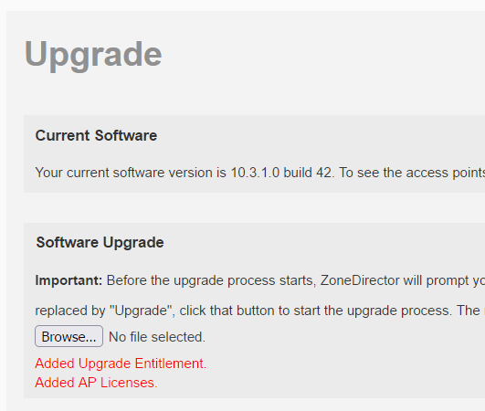

# Add AP Licenses and Upgrade Entitlement to a ZoneDirector 1200

To prevent e-waste and save these from landfills, you may use the procedure here to enable upgrades and remove the 5 AP limit from your ZoneDirector for use in a homelab or personal environment.

>If you have a ZoneDirector 1000/1100/3000/5000 then you can still add AP Licenses, but you'll have to (temporarily) install older software.  
>Follow the instructions here: [Add AP Licenses to a ZoneDirector](ZDAddLicenses.md)

>If you also want a root shell, follow the instructions here: [Add a Root Shell to your ZoneDirector 1200](ZD1200AddRootShell.md)

[This patch](../images/zd.licenses.patch.img) should be uploaded as a Software Upgrade (`Administer` > `Upgrade` > `Software Upgrade`).  
> The upload process completes the patching; no upgrade will be offered. Instead you will receive confirmation the patch has successfully completed.  
> 

## Creating the Patch Installation Image yourself (from Linux or WSL)

> Although [the patch](../images/zd.licenses.patch.img) can be directly downloaded and used, I recommend either creating the patch yourself or [decrypting the patch](DecryptRuckusBackups.md) to verify it does only what it should.

Save the script below to e.g. `create_patched_zdimage.sh`, make it executable (e.g. `chmod +x create_patched_zdimage.sh`), then you can create an upgrade an installation image:-
```bash
./create_patched_zdimage.sh zd.licenses.patch.img
```

```bash
#!/bin/bash

function rks_encrypt {
RUCKUS_SRC="$1" RUCKUS_DEST="$2" python3 - <<END
import os
import struct

input_path = os.environ['RUCKUS_SRC']
output_path = os.environ['RUCKUS_DEST']

(xor_int, xor_flip) = struct.unpack('QQ', b')\x1aB\x05\xbd,\xd6\xf25\xad\xb8\xe0?T\xc58')
structInt8 = struct.Struct('Q')

with open(input_path, "rb") as input_file:
    with open(output_path, "wb") as output_file:
        input_len = os.path.getsize(input_path)
        input_blocks = input_len // 8
        output_int = 0
        input_data = input_file.read(input_blocks * 8)
        for input_int in struct.unpack_from(str(input_blocks) + "Q", input_data):
            output_int ^= xor_int ^ input_int
            xor_int ^= xor_flip
            output_file.write(structInt8.pack(output_int))
        
        input_block = input_file.read()
        input_padding = 8 - len(input_block)
        input_int = structInt8.unpack(input_block.ljust(8, bytes([input_padding | input_padding << 4])))[0]
        output_int ^= xor_int ^ input_int
        output_file.write(structInt8.pack(output_int))
END
}

cat <<END >metadata
PURPOSE=upgrade
VERSION=10.99.99.99
BUILD=999
REQUIRE_SIZE=1000
REQUIRE_VERSIONS=9.9.0.0 9.10.0.0 9.10.1.0 9.10.2.0 9.12.0.0 9.12.1.0 9.12.2.0 9.12.3.0 9.13.0.0 9.13.1.0 9.13.2.0 9.13.3.0 10.0.0.0 10.1.0.0 10.1.1.0 10.1.2.0 10.2.0.0 10.2.1.0 10.3.0.0 10.3.1.0 10.4.0.0 10.4.1.0 10.5.0
REQUIRE_PLATFORM=nar5520
REQUIRE_SUBPLATFORM=cob7402
END

cat <<END >all_files
*
END

cat <<END >upgrade_check.sh
#!/bin/sh

CUR_WRAP_MD5=\`md5sum /bin/sys_wrapper.sh | cut -d' ' -f1\`

mount -o remount,rw /

cd /etc/persistent-scripts

mkdir -p patch-storage
cd patch-storage

if [ -f sys_wrapper.sh ] ; then
    cat sys_wrapper.sh > /bin/sys_wrapper.sh
else
    cat /bin/sys_wrapper.sh > sys_wrapper.sh
fi
cat <<EOF >support
<support-list>
	<support zd-serial-number="\`cat /bin/SERIAL\`" service-purchased="904" date-start="`date +%s`" date-end="1819731540" ap-support-number="licensed" DELETABLE="false"></support>
</support-list>
EOF
sed 's/<support-list/<support-list status="1"/' support >/writable/etc/airespider/support-list.xml
rm -f support.spt
tar -czf support.spt support

cat <<EOF >/etc/airespider-images/license-list.xml
<license-list name="150 AP Management" max-ap="150" max-client="4000" value="0x0000000f" urlfiltering-ap-license="0">
    <license id="1" name="145 AP Management" inc-ap="145" generated-by="264556" serial-number="\`cat /bin/SERIAL\`" status="0" detail="" />
</license-list>
EOF

sed -i -e '/verify-upload-support)/a \\
        cd \/tmp\\
        cat \/etc\/persistent-scripts\/patch-storage\/support > support\\
        echo "OK"\\
        ;;\\
    verify-upload-support-unpatched)' -e '/wget-support-entitlement)/a \\
        cat \/etc\/persistent-scripts\/patch-storage\/support\.spt > "\/tmp\/\$1"\\
        echo "OK"\\
        ;;\\
    wget-support-entitlement-unpatched)' /bin/sys_wrapper.sh
NEW_WRAP_MD5=\`md5sum /bin/sys_wrapper.sh | cut -d' ' -f1\`
sed -i -e "s/\$CUR_WRAP_MD5/\$NEW_WRAP_MD5/" /file_list.txt

mount -o remount,ro /

echo "Added Upgrade Entitlement.\n<br />"
echo "Added AP Licenses.\n<br />"
END

chmod +x upgrade_check.sh
rm -f zd.patch.tar zd.patch.tar.gz
tar czf zd.patch.tgz metadata all_files upgrade_check.sh
rks_encrypt zd.patch.tgz "$1"
rm all_files metadata upgrade_check.sh zd.patch.tgz
```
